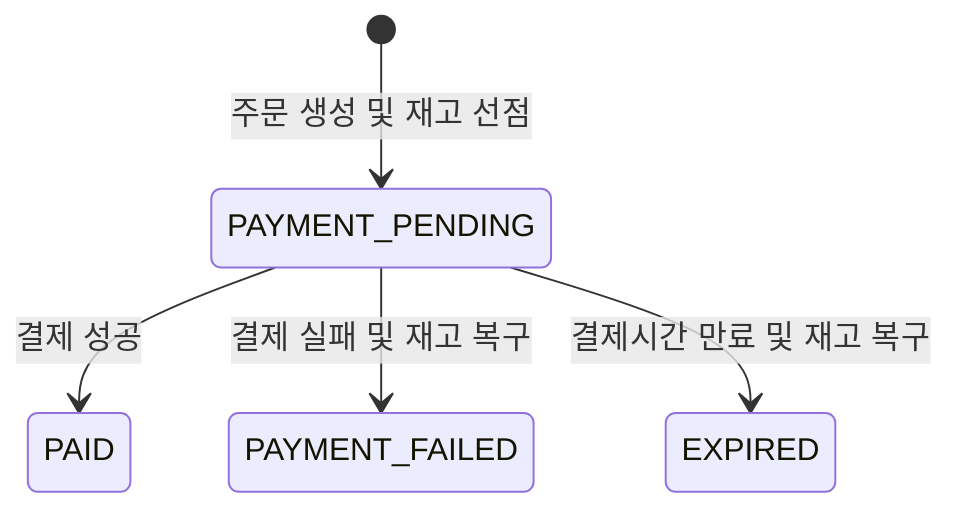

# Shop — 이커머스 주문·결제 시스템

동시 주문과 결제 과정에서 발생할 수 있는 **재고 및 주문 상태의 정합성 문제**를 중심으로 설계하고, Redis 캐시와 실행계획 기반 인덱스 튜닝으로 상품 조회 경로를 개선·검증한 Spring Boot 기반 이커머스 프로젝트입니다. 동일 키의 동시 캐시 미스를 병합해 캐시 스탬피드를 완화하고, Redis 장애가 상품 조회와 DB 변경 작업의 장애로 전파되지 않도록 Look-aside Fallback을 구성했습니다. 또한 20만 건의 상품 검색 SQL을 `EXPLAIN ANALYZE`로 분석해 `(price ASC, id DESC)` 복합 인덱스를 설계하고, DB 실행계획과 k6 API 부하 테스트에서 개선 효과를 교차 검증했습니다.

회원, 상품, 장바구니, 주문 기능을 구현했으며, 조건부 UPDATE와 멱등성 있는 상태 전이를 적용해 재고 초과 판매, 결제 결과 중복 호출, 결제 완료와 주문 만료의 경합 상황을 처리했습니다. 핵심 시나리오는 Testcontainers의 MySQL 환경에서 통합 테스트와 멀티스레드 동시성 테스트로 검증했습니다.

## 프로젝트 정보

| 항목 | 내용 |
| --- | --- |
| 개발 기간 | 2026.04 ~ 2026.07 |
| 개발 인원 | 1명 |
| 담당 범위 | 백엔드 설계·구현, 테스트 및 프론트엔드 구현 |
| 주요 관심사 | 주문·결제 동시성, 데이터 정합성, 캐시 안정성, 인증·인가, 동적 검색 |

## 기술 스택

### Backend

- Java 21
- Spring Boot 3.5
- Spring Data JPA
- Spring Security
- QueryDSL
- JWT
- Redis Cache
- Gradle

### Database & Test

- MySQL 8
- JUnit 5
- Spring Boot Test
- Testcontainers
- k6
- Flyway

### Frontend

- React 19
- TypeScript
- Vite
- Axios

## 주요 기능

- 회원가입 및 로그인
- JWT Access Token·Refresh Token 발급과 재발급
- Refresh Token Rotation 및 로그아웃 처리
- 사용자·관리자 역할 기반 접근 제어
- 상품 등록·수정·상태 및 재고 관리
- 키워드·카테고리·가격 범위 기반 상품 복합 검색
- 가격 범위·가격순 검색에 `(price ASC, id DESC)` 복합 인덱스를 적용하고 `EXPLAIN ANALYZE`와 k6로 전후 성능 검증
- 검증된 인덱스 DDL을 Flyway 버전 마이그레이션으로 관리
- Redis 기반 상품 단건 조회 캐시, 동일 키 동시 미스 병합 및 키 단위 무효화
- Redis 조회·저장·무효화 실패 시 MySQL 원본 데이터와 DB 작업을 우선하는 Look-aside Fallback
- 장바구니 상품 추가·수정·삭제
- 복수 상품 주문 및 주문 당시 상품 정보 보존
- 결제 성공·실패 처리
- 결제 대기시간이 지난 주문의 자동 만료 및 재고 복구

## 핵심 설계

### 주문·결제 상태 흐름



주문 상태가 `PAYMENT_PENDING`일 때만 다음 상태로 변경할 수 있도록 조건부 UPDATE를 사용했습니다. 결제 성공, 결제 실패, 만료 처리가 동시에 또는 중복 실행돼도 최초로 상태 변경에 성공한 처리만 후속 작업을 수행합니다.

### 재고 차감

재고를 조회한 뒤 애플리케이션에서 차감하면 여러 요청이 동일한 재고 값을 읽어 초과 판매가 발생할 수 있습니다. 이를 방지하기 위해 다음 조건을 포함한 원자적 UPDATE로 재고를 차감합니다.

- 상품 상태가 `ACTIVE`일 것
- 현재 재고가 주문 수량 이상일 것
- 차감 결과가 0이면 상품 상태를 `SOLD_OUT`으로 변경할 것

UPDATE 결과가 0건이면 재고 부족 또는 판매 불가능 상품으로 처리합니다. 여러 상품을 주문할 때는 상품 ID 순서로 차감해 서로 다른 순서의 자원 점유로 인한 데드락 가능성도 줄였습니다.

### 주문 상품 스냅샷

상품의 이름이나 가격이 변경되거나 상품이 삭제된 이후에도 주문 당시 정보를 유지할 수 있도록 주문 상품에 다음 값을 별도로 저장합니다.

- 상품 ID
- 주문 당시 상품명
- 주문 당시 단가
- 주문 수량

### 만료 주문 처리

결제 대기 주문은 생성 시점으로부터 15분의 유효시간을 갖습니다. 스케줄러는 30초마다 만료된 주문을 최대 100건씩 조회하며, 각 주문을 별도 트랜잭션으로 처리합니다.

- `status + expiresAt` 복합 인덱스로 만료 대상 조회
- `PAYMENT_PENDING` 상태이며 실제 만료된 주문만 선점
- 선점에 성공한 처리만 재고 복구
- 개별 주문 처리 실패가 다음 주문 처리에 영향을 주지 않도록 예외 격리

### 인증·인가

- 비밀번호를 BCrypt로 해싱
- Access Token과 Refresh Token의 용도 분리
- Refresh Token을 HttpOnly 쿠키로 전달
- 토큰 재발급 시 기존 Refresh Token을 새 토큰으로 교체
- 로그아웃 시 저장된 Refresh Token 무효화
- `USER`, `ADMIN` 역할에 따른 API 접근 제어

운영 환경에서는 HTTPS를 적용하고 Refresh Token 쿠키의 `Secure` 옵션을 활성화해야 합니다.

### Redis 상품 조회 캐시와 장애 Fallback

읽기 빈도가 높은 상품 단건 조회(`GET /api/products/{productId}`)에 Spring Cache와 Redis를 적용했습니다.

- 상품 ID를 캐시 키로 사용하고 TTL을 10분으로 설정
- null 응답은 캐시하지 않아 일시적인 조회 실패가 남지 않도록 구성
- `sync = true`로 동일 키의 동시 캐시 미스를 병합해 Cache Stampede 완화
- 상품 정보·재고·판매 상태 수정 및 삭제 시 해당 상품 키를 즉시 무효화
- `ProductResponse` 전용 JSON 직렬화로 캐시 데이터 형식을 명확히 제한

조회 성능뿐 아니라 데이터 최신성을 함께 고려해, 쓰기 작업마다 전체 캐시를 비우는 대신 변경된 상품의 키만 제거합니다.

Redis는 조회 성능을 높이기 위한 보조 저장소로 두고, MySQL을 원본 데이터로 유지하는 Look-aside 패턴을 적용했습니다. `CacheErrorHandler`에서 Redis 예외를 다음과 같이 격리합니다.

| 실패 지점 | Fallback 동작 |
| --- | --- |
| 캐시 조회(GET) | 경고 로그를 남기고 `@Cacheable` 대상 메서드를 실행해 MySQL에서 조회 |
| 캐시 저장(PUT) | 캐시 저장 실패를 전파하지 않고 이미 조회한 MySQL 결과를 반환 |
| 키 무효화(EVICT) | 경고 로그를 남기고 상품 변경·재고 처리 등 DB 작업은 계속 수행 |
| 전체 무효화(CLEAR) | 캐시 예외를 서비스 계층으로 전파하지 않고 경고 로그 기록 |

이 Fallback은 Redis 장애 시 서비스 기능을 계속 제공하기 위한 가용성 대책입니다. 다만 캐시 무효화 실패 시 TTL이 끝날 때까지 오래된 데이터가 노출될 수 있고, Redis 장애가 지속되면 조회 요청이 MySQL로 집중될 수 있습니다. 현재 구현은 예외 격리와 로그 기록까지 담당하며, 무효화 재시도와 DB 과부하 보호는 별도 운영 대책이 필요합니다.

### 실행계획 기반 상품 검색 인덱스 튜닝

20만 건의 상품 데이터에서 가격 범위 검색과 `price ASC, id DESC` 정렬을 수행하는 API를 대상으로 실행계획과 부하 테스트를 연결해 검증했습니다.

```http
GET /api/products?minPrice=50000&maxPrice=60000&page=0&size=12&sort=priceAsc
```

인덱스 적용 전에는 20만 건 전체를 탐색하고 조건에 맞는 9,551건을 정렬한 뒤 12건을 반환했습니다. 가격 범위와 정렬 순서를 함께 처리하도록 다음 복합 인덱스를 설계했습니다.

```sql
CREATE INDEX idx_product_price_id
    ON product (price ASC, id DESC);
```

- `price`: 가격 범위 조건과 첫 번째 정렬 기준
- `id`: 동일 가격 상품의 정렬 순서를 결정하는 두 번째 기준
- `status` 제외: 선택도가 낮고 `<> 'HIDDEN'` 조건이므로 선두 컬럼으로 두지 않음

인덱스 적용 후 목록 SQL은 Table scan과 별도 Sort에서 Index range scan으로 변경됐으며, `LIMIT 12`에 필요한 행을 찾은 즉시 탐색을 종료했습니다. 검증된 DDL은 Flyway `V3` 마이그레이션으로 버전 관리했습니다.

| 측정 항목 | 적용 전 중앙값 | 적용 후 중앙값 | 변화 |
| --- | ---: | ---: | ---: |
| 목록 SQL `EXPLAIN ANALYZE` | 185 ms | 0.178 ms | 약 99.9% 감소 |
| COUNT SQL `EXPLAIN ANALYZE` | 84.5 ms | 29.4 ms | 약 65.2% 감소 |
| k6 평균 응답시간 | 704.27 ms | 28.35 ms | 약 96.0% 감소 |
| k6 p95 | 1,333.63 ms | 39.86 ms | 약 97.0% 감소 |
| k6 p99 | 1,497.33 ms | 74.48 ms | 약 95.0% 감소 |

실행계획은 적용 전후 각각 5회, k6는 10 RPS·2분 조건에서 각각 3회 측정하고 중앙값을 대표값으로 사용했습니다. 적용 전 1회차에는 처리 지연 누적으로 dropped iteration 81건이 발생했지만 적용 후 3회 모두 dropped iteration과 HTTP 실패가 0건이었습니다. 세부 실험 조건과 원문 결과는 [`performance/index-tuning`](./performance/index-tuning/README.md)에 기록했습니다.

## 문제 해결

### 1. 동시 주문 시 재고 초과 판매 방지

**문제**

재고 조회와 차감을 분리하면 동시 요청들이 동일한 재고를 읽고 주문을 성공시킬 수 있습니다.

**해결**

판매 상태와 남은 재고를 WHERE 조건으로 검사하면서 재고를 차감하는 조건부 UPDATE를 사용했습니다. 영향을 받은 행이 1건일 때만 주문 상품을 생성하도록 구성했습니다.

**검증**

재고가 10개인 상품에 20개의 주문을 동시에 요청했을 때 성공한 주문 10건, 생성된 주문 10건, 최종 재고 0개가 일치하는지 멀티스레드 통합 테스트로 검증했습니다.

### 2. 복수 상품 주문의 원자성 보장

**문제**

여러 상품 중 일부 상품의 재고만 부족한 경우, 앞에서 차감한 상품의 재고가 그대로 남으면 데이터 불일치가 발생합니다.

**해결**

주문 생성과 전체 상품의 재고 차감을 하나의 트랜잭션으로 처리했습니다. 하나라도 차감에 실패하면 주문 저장과 기존 재고 차감을 모두 롤백합니다.

**검증**

복수 상품 중 하나의 재고가 부족한 시나리오에서 모든 상품의 재고와 주문 데이터가 변경되지 않는지 확인했습니다.

### 3. 결제 결과 중복 호출의 멱등성 확보

**문제**

결제 실패 응답이나 만료 처리가 중복 호출되면 동일한 재고가 여러 번 복구될 수 있습니다.

**해결**

최초 요청만 `PAYMENT_PENDING`에서 실패 또는 만료 상태로 전환할 수 있게 했습니다. 상태 변경에 성공한 경우에만 재고를 복구해 동일한 요청이 반복돼도 결과가 한 번만 반영되도록 구성했습니다.

**검증**

결제 실패와 만료 처리를 각각 세 번 호출해도 재고가 최초 수량까지만 복구되는지 검증했습니다.

### 4. 결제 성공과 주문 만료의 경합 처리

**문제**

결제 완료 응답과 주문 만료 스케줄러가 동시에 실행되면 결제가 완료됐는데 재고가 복구되거나, 만료됐는데 재고가 차감된 상태로 남을 수 있습니다.

**해결**

두 작업 모두 `PAYMENT_PENDING` 상태를 조건으로 상태 전이를 시도하게 했습니다. 먼저 상태를 변경한 작업만 성공하며, 나머지 작업은 후속 로직을 실행하지 않습니다.

**검증**

결제 완료와 만료 처리를 두 스레드에서 동시에 실행한 후 다음 두 결과 중 하나만 성립하는지 확인했습니다.

- `PAID` 상태이며 재고가 차감된 상태
- `EXPIRED` 상태이며 재고가 복구된 상태

### 5. 캐시 스탬피드와 Redis 장애 전파 완화

**문제**

동일 상품의 캐시가 만료된 순간 요청이 동시에 들어오면 여러 요청이 한꺼번에 MySQL을 조회할 수 있습니다. 또한 Redis 조회·저장·무효화 예외가 그대로 전파되면 원본 데이터베이스가 정상이어도 상품 조회나 변경 API가 실패할 수 있습니다.

**해결**

`@Cacheable(sync = true)`로 동일 키의 동시 캐시 미스를 병합해 한 요청이 원본 데이터를 적재하는 동안 중복 조회가 몰리는 현상을 완화했습니다. Redis 예외는 `CacheErrorHandler`에서 처리해 GET 실패 시 MySQL 조회로 전환하고, PUT 실패 시 조회 결과를 그대로 반환하며, EVICT/CLEAR 실패 시 DB 작업은 계속 수행하도록 구성했습니다.

**트레이드오프**

Fallback은 Redis 장애가 즉시 서비스 장애로 이어지는 것을 막지만, 장애 중 조회 부하가 MySQL로 이동합니다. 특히 무효화 실패는 TTL 동안 오래된 캐시를 남길 수 있으므로 경고 로그를 모니터링하고, 재시도·Outbox와 DB 보호 전략을 후속 과제로 관리합니다.

### 6. 가격 범위 검색의 전체 탐색과 정렬 제거

**문제**

20만 건의 상품 데이터에서 가격 범위 검색과 가격 오름차순 정렬을 수행할 때 목록 SQL이 전체 테이블을 탐색하고 약 9,551건을 정렬했습니다. k6 부하 테스트에서도 높은 지연과 목표 요청률을 처리하지 못한 실행이 관찰됐습니다.

**해결**

Hibernate가 생성한 실제 목록·COUNT SQL을 확보하고 `EXPLAIN ANALYZE`로 병목을 확인했습니다. 가격 범위 조건과 `price ASC, id DESC` 정렬을 함께 처리하도록 `(price ASC, id DESC)` 복합 인덱스를 설계했습니다.

**검증**

동일 SQL을 인덱스 적용 전후 각각 5회 실행한 결과 목록 SQL 중앙값은 185ms에서 0.178ms로, COUNT SQL은 84.5ms에서 29.4ms로 감소했습니다. 동일 API를 k6로 각각 3회 측정한 결과 p95 중앙값은 1,333.63ms에서 39.86ms로 약 97% 감소했으며, 적용 후 dropped iteration과 HTTP 실패는 모두 0건이었습니다.

## 테스트

Docker와 Testcontainers를 이용해 MySQL 8.4 환경에서 테스트했으며 전체 테스트가 통과했습니다.

| 구분 | 검증 내용 |
| --- | --- |
| 주문 생성 | 주문 생성 시 재고 차감 및 `PAYMENT_PENDING` 상태 확인 |
| 트랜잭션 | 복수 상품 중 하나의 재고가 부족할 때 전체 롤백 |
| 동시 주문 | 재고보다 많은 요청에도 초과 판매가 발생하지 않는지 확인 |
| 결제 실패 | 실패 상태 전이 및 차감된 재고 복구 |
| 중복 결제 실패 | 중복 호출에도 재고가 한 번만 복구되는지 확인 |
| 주문 만료 | 만료된 주문의 상태 변경 및 재고 복구 |
| 중복 만료 | 반복 실행에도 재고가 한 번만 복구되는지 확인 |
| 만료 조건 | 만료시간이 지나지 않은 주문을 처리하지 않는지 확인 |
| 상태 경합 | 결제 성공과 만료가 동시에 실행돼도 상태와 재고가 일치하는지 확인 |

```bash
./gradlew test
```

Windows에서는 다음 명령으로 실행할 수 있습니다.

```powershell
.\gradlew.bat test
```

### k6 상품 조회 부하 테스트

`constant-arrival-rate` 실행기로 상품 단건 조회의 요청률을 고정하고, 캐시 적용 전과 Redis warm cache 구간을 각각 반복 측정했습니다. 모든 측정에서 HTTP 실패율은 0%였습니다.

| 구분 | 실행 조건 | 유효 요청 | p95 응답시간 | 비고 |
| --- | --- | ---: | ---: | --- |
| 적용 전 1차 | 약 100 RPS, 3분 | 18,001 | 4.59 ms | dropped 0 |
| 적용 전 2차 | 약 100 RPS, 3분 | 18,001 | 4.59 ms | dropped 0 |
| 적용 전 3차 | 약 100 RPS, 3분 | 17,998 | 6.06 ms | dropped 3 |
| Redis warm 1차 | 10 RPS, 2분 | 1,201 | 7.73 ms | HTTP 실패 0% |
| Redis warm 2차 | 10 RPS, 2분 | 1,201 | 5.28 ms | HTTP 실패 0% |
| Redis warm 3차 | 10 RPS 설정 | 702 | 5.54 ms | dropped 1,002로 부하 발생기 이상치 분리 |

기존 결과와 warm cache 결과는 요청률과 실행 시간이 달라 이 수치로 개선율을 계산하지 않았습니다. 현재 결과는 캐시 hit 경로의 안정성과 실패율을 확인하는 근거로 사용하며, 정량적인 전후 비교는 동일한 RPS·duration·실행 환경으로 다시 측정해야 합니다.

```bash
k6 run -e RATE=100 -e DURATION=3m performance/redis-cache/k6/scripts/product-read-baseline.js
k6 run -e RATE=100 -e DURATION=3m performance/redis-cache/k6/scripts/product-read-warm.js
```

측정 시 애플리케이션·MySQL·Redis 상태를 동일하게 맞추고, warm 테스트는 `setup()`에서 대상 상품을 한 번 조회해 캐시를 예열합니다.

### k6 상품 검색 인덱스 Before/After 테스트

가격 범위 검색 API에 `constant-arrival-rate`로 10 RPS를 2분간 유지하고, 인덱스 적용 전후를 각각 3회 측정했습니다. 모든 실행에서 HTTP 실패율은 0%였으며, 대표값은 세 번의 중앙값입니다.

| 구분 | 평균 | p95 | p99 | dropped iterations |
| --- | ---: | ---: | ---: | ---: |
| 인덱스 적용 전 중앙값 | 704.27 ms | 1,333.63 ms | 1,497.33 ms | 0건¹ |
| 인덱스 적용 후 중앙값 | 28.35 ms | 39.86 ms | 74.48 ms | 0건 |

¹ 적용 전 1회차에는 DB 처리 지연이 누적되며 81건이 dropped됐습니다. 해당 이상치를 삭제하지 않고 원문 결과를 보존했으며, 단일 실행이 결론을 왜곡하지 않도록 3회 중앙값으로 비교했습니다.

```bash
k6 run -e TEST_TYPE=load -e RATE=10 -e DURATION=2m performance/index-tuning/k6/scripts/product-search.js
```

## 실행 방법

### 사전 준비

- Java 21
- MySQL 8
- Redis
- Node.js
- k6

### 환경 변수

프로젝트 루트에 `.env` 파일을 만들고 다음 값을 설정합니다.

```properties
DB_USERNAME=your_mysql_username
DB_PASSWORD=your_mysql_password
JWT_SECRET=your_base64_encoded_secret_key
REDIS_HOST=localhost
REDIS_PORT=6379
```

`.env`에는 비밀번호와 JWT Secret이 포함되므로 Git에 커밋하지 않습니다.

### Backend

MySQL에 `shop` 데이터베이스를 생성하고 Redis를 실행한 후 애플리케이션을 시작합니다.

```sql
CREATE DATABASE shop;
```

```bash
./gradlew bootRun
```

애플리케이션 실행 후 Swagger UI에서 API 명세를 확인할 수 있습니다.

```text
http://localhost:8080/swagger-ui.html
```

### Frontend

```bash
cd frontend
npm install
npm run dev
```

```text
http://localhost:5173
```

## 프로젝트 구조

```text
shop
├─ src/main/java/com/taejun/shop
│  ├─ domain
│  │  ├─ member
│  │  ├─ product
│  │  ├─ cart
│  │  ├─ order
│  │  └─ payment
│  └─ global
│     ├─ config
│     ├─ exception
│     └─ security
├─ performance
│  ├─ redis-cache
│  └─ index-tuning
│     ├─ explain-analyze
│     └─ k6
├─ src/main/resources/db/migration
│  └─ V3__add_product_composite-index.sql
├─ src/test/java/com/taejun/shop
│  ├─ domain
│  └─ support
└─ frontend
   └─ src
      ├─ api
      ├─ auth
      ├─ components
      ├─ pages
      └─ types
```

도메인별로 컨트롤러, 서비스, 리포지토리, 엔티티 및 DTO를 구성하고 공통 설정과 보안·예외 처리는 `global` 패키지로 분리했습니다.

## 향후 개선 계획

- Refresh Token 해싱 저장
- 운영 환경별 CORS 및 쿠키 보안 설정 분리
- Flyway가 전체 스키마 변경의 단일 주체가 되도록 초기 마이그레이션을 정리하고 Hibernate `ddl-auto=validate`로 전환
- 허용된 필드만 사용할 수 있도록 상품 정렬 조건 제한
- 동일 조건의 Redis 적용 전·후 k6 재측정과 병목 구간 프로파일링
- Redis 무효화 실패 작업의 Outbox 저장 및 재시도 처리
- Redis 장애 통합 테스트와 장애 중 MySQL 과부하를 막기 위한 타임아웃·트래픽 보호 전략 보완
- CI에서 Testcontainers 통합 테스트 자동 실행
- 운영 환경을 고려한 만료 주문 다중 인스턴스 처리 전략 보완
