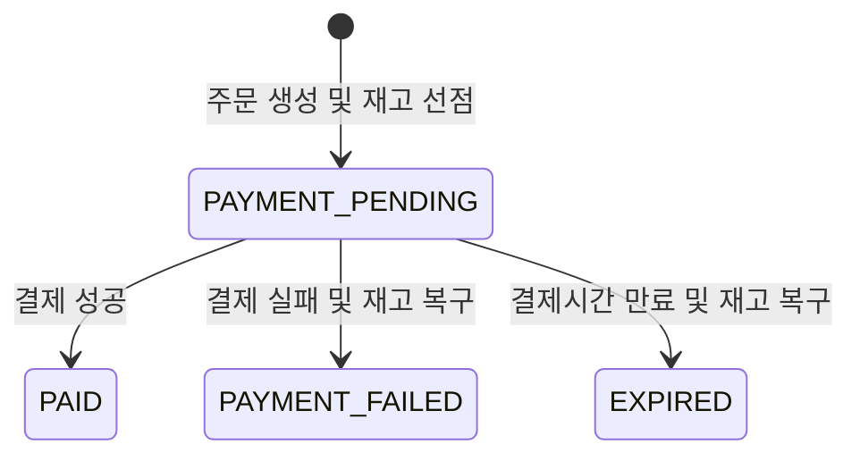

# Shop — 이커머스 주문·결제 시스템

동시 주문과 결제 과정에서 발생할 수 있는 **재고 및 주문 상태의 정합성 문제**를 중심으로 설계한 Spring Boot 기반 이커머스 프로젝트입니다.

회원, 상품, 장바구니, 주문 기능을 구현했으며, 조건부 UPDATE와 멱등성 있는 상태 전이를 적용해 재고 초과 판매, 결제 결과 중복 호출, 결제 완료와 주문 만료의 경합 상황을 처리했습니다. 핵심 시나리오는 Testcontainers의 MySQL 환경에서 통합 테스트와 멀티스레드 동시성 테스트로 검증했습니다.

## 프로젝트 정보

| 항목 | 내용 |
| --- | --- |
| 개발 기간 | 2026.04 ~ 2026.07 |
| 개발 인원 | 1명 |
| 담당 범위 | 백엔드 설계·구현, 테스트 및 프론트엔드 구현 |
| 주요 관심사 | 주문·결제 동시성, 데이터 정합성, 인증·인가, 동적 검색 |

## 기술 스택

### Backend

- Java 21
- Spring Boot 3.5
- Spring Data JPA
- Spring Security
- QueryDSL
- JWT
- Gradle

### Database & Test

- MySQL 8
- JUnit 5
- Spring Boot Test
- Testcontainers

### Frontend

- React 19
- TypeScript
- Vite
- Axios

## 주요 기능

- 회원가입 및 로그인
- JWT Access Token·Refresh Token 발급과 재발급
- Refresh Token Rotation 및 로그아웃 처리
- 사용자·관리자 역할 기반 접근 제어
- 상품 등록·수정·상태 및 재고 관리
- 키워드·카테고리·가격 범위 기반 상품 복합 검색
- 장바구니 상품 추가·수정·삭제
- 복수 상품 주문 및 주문 당시 상품 정보 보존
- 결제 성공·실패 처리
- 결제 대기시간이 지난 주문의 자동 만료 및 재고 복구

## 핵심 설계

### 주문·결제 상태 흐름



주문 상태가 `PAYMENT_PENDING`일 때만 다음 상태로 변경할 수 있도록 조건부 UPDATE를 사용했습니다. 결제 성공, 결제 실패, 만료 처리가 동시에 또는 중복 실행돼도 최초로 상태 변경에 성공한 처리만 후속 작업을 수행합니다.

### 재고 차감

재고를 조회한 뒤 애플리케이션에서 차감하면 여러 요청이 동일한 재고 값을 읽어 초과 판매가 발생할 수 있습니다. 이를 방지하기 위해 다음 조건을 포함한 원자적 UPDATE로 재고를 차감합니다.

- 상품 상태가 `ACTIVE`일 것
- 현재 재고가 주문 수량 이상일 것
- 차감 결과가 0이면 상품 상태를 `SOLD_OUT`으로 변경할 것

UPDATE 결과가 0건이면 재고 부족 또는 판매 불가능 상품으로 처리합니다. 여러 상품을 주문할 때는 상품 ID 순서로 차감해 서로 다른 순서의 자원 점유로 인한 데드락 가능성도 줄였습니다.

### 주문 상품 스냅샷

상품의 이름이나 가격이 변경되거나 상품이 삭제된 이후에도 주문 당시 정보를 유지할 수 있도록 주문 상품에 다음 값을 별도로 저장합니다.

- 상품 ID
- 주문 당시 상품명
- 주문 당시 단가
- 주문 수량

### 만료 주문 처리

결제 대기 주문은 생성 시점으로부터 15분의 유효시간을 갖습니다. 스케줄러는 30초마다 만료된 주문을 최대 100건씩 조회하며, 각 주문을 별도 트랜잭션으로 처리합니다.

- `status + expiresAt` 복합 인덱스로 만료 대상 조회
- `PAYMENT_PENDING` 상태이며 실제 만료된 주문만 선점
- 선점에 성공한 처리만 재고 복구
- 개별 주문 처리 실패가 다음 주문 처리에 영향을 주지 않도록 예외 격리

### 인증·인가

- 비밀번호를 BCrypt로 해싱
- Access Token과 Refresh Token의 용도 분리
- Refresh Token을 HttpOnly 쿠키로 전달
- 토큰 재발급 시 기존 Refresh Token을 새 토큰으로 교체
- 로그아웃 시 저장된 Refresh Token 무효화
- `USER`, `ADMIN` 역할에 따른 API 접근 제어

운영 환경에서는 HTTPS를 적용하고 Refresh Token 쿠키의 `Secure` 옵션을 활성화해야 합니다.

## 문제 해결

### 1. 동시 주문 시 재고 초과 판매 방지

**문제**

재고 조회와 차감을 분리하면 동시 요청들이 동일한 재고를 읽고 주문을 성공시킬 수 있습니다.

**해결**

판매 상태와 남은 재고를 WHERE 조건으로 검사하면서 재고를 차감하는 조건부 UPDATE를 사용했습니다. 영향을 받은 행이 1건일 때만 주문 상품을 생성하도록 구성했습니다.

**검증**

재고가 10개인 상품에 20개의 주문을 동시에 요청했을 때 성공한 주문 10건, 생성된 주문 10건, 최종 재고 0개가 일치하는지 멀티스레드 통합 테스트로 검증했습니다.

### 2. 복수 상품 주문의 원자성 보장

**문제**

여러 상품 중 일부 상품의 재고만 부족한 경우, 앞에서 차감한 상품의 재고가 그대로 남으면 데이터 불일치가 발생합니다.

**해결**

주문 생성과 전체 상품의 재고 차감을 하나의 트랜잭션으로 처리했습니다. 하나라도 차감에 실패하면 주문 저장과 기존 재고 차감을 모두 롤백합니다.

**검증**

복수 상품 중 하나의 재고가 부족한 시나리오에서 모든 상품의 재고와 주문 데이터가 변경되지 않는지 확인했습니다.

### 3. 결제 결과 중복 호출의 멱등성 확보

**문제**

결제 실패 응답이나 만료 처리가 중복 호출되면 동일한 재고가 여러 번 복구될 수 있습니다.

**해결**

최초 요청만 `PAYMENT_PENDING`에서 실패 또는 만료 상태로 전환할 수 있게 했습니다. 상태 변경에 성공한 경우에만 재고를 복구해 동일한 요청이 반복돼도 결과가 한 번만 반영되도록 구성했습니다.

**검증**

결제 실패와 만료 처리를 각각 세 번 호출해도 재고가 최초 수량까지만 복구되는지 검증했습니다.

### 4. 결제 성공과 주문 만료의 경합 처리

**문제**

결제 완료 응답과 주문 만료 스케줄러가 동시에 실행되면 결제가 완료됐는데 재고가 복구되거나, 만료됐는데 재고가 차감된 상태로 남을 수 있습니다.

**해결**

두 작업 모두 `PAYMENT_PENDING` 상태를 조건으로 상태 전이를 시도하게 했습니다. 먼저 상태를 변경한 작업만 성공하며, 나머지 작업은 후속 로직을 실행하지 않습니다.

**검증**

결제 완료와 만료 처리를 두 스레드에서 동시에 실행한 후 다음 두 결과 중 하나만 성립하는지 확인했습니다.

- `PAID` 상태이며 재고가 차감된 상태
- `EXPIRED` 상태이며 재고가 복구된 상태

## 테스트

Docker와 Testcontainers를 이용해 MySQL 8.4 환경에서 테스트했으며 전체 테스트가 통과했습니다.

| 구분 | 검증 내용 |
| --- | --- |
| 주문 생성 | 주문 생성 시 재고 차감 및 `PAYMENT_PENDING` 상태 확인 |
| 트랜잭션 | 복수 상품 중 하나의 재고가 부족할 때 전체 롤백 |
| 동시 주문 | 재고보다 많은 요청에도 초과 판매가 발생하지 않는지 확인 |
| 결제 실패 | 실패 상태 전이 및 차감된 재고 복구 |
| 중복 결제 실패 | 중복 호출에도 재고가 한 번만 복구되는지 확인 |
| 주문 만료 | 만료된 주문의 상태 변경 및 재고 복구 |
| 중복 만료 | 반복 실행에도 재고가 한 번만 복구되는지 확인 |
| 만료 조건 | 만료시간이 지나지 않은 주문을 처리하지 않는지 확인 |
| 상태 경합 | 결제 성공과 만료가 동시에 실행돼도 상태와 재고가 일치하는지 확인 |

```bash
./gradlew test
```

Windows에서는 다음 명령으로 실행할 수 있습니다.

```powershell
.\gradlew.bat test
```

## 실행 방법

### 사전 준비

- Java 21
- MySQL 8
- Node.js

### 환경 변수

프로젝트 루트에 `.env` 파일을 만들고 다음 값을 설정합니다.

```properties
DB_USERNAME=your_mysql_username
DB_PASSWORD=your_mysql_password
JWT_SECRET=your_base64_encoded_secret_key
```

`.env`에는 비밀번호와 JWT Secret이 포함되므로 Git에 커밋하지 않습니다.

### Backend

MySQL에 `shop` 데이터베이스를 생성한 후 애플리케이션을 실행합니다.

```sql
CREATE DATABASE shop;
```

```bash
./gradlew bootRun
```

애플리케이션 실행 후 Swagger UI에서 API 명세를 확인할 수 있습니다.

```text
http://localhost:8080/swagger-ui.html
```

### Frontend

```bash
cd frontend
npm install
npm run dev
```

```text
http://localhost:5173
```

## 프로젝트 구조

```text
shop
├─ src/main/java/com/taejun/shop
│  ├─ domain
│  │  ├─ member
│  │  ├─ product
│  │  ├─ cart
│  │  ├─ order
│  │  └─ payment
│  └─ global
│     ├─ config
│     ├─ exception
│     └─ security
├─ src/test/java/com/taejun/shop
│  ├─ domain
│  └─ support
└─ frontend
   └─ src
      ├─ api
      ├─ auth
      ├─ components
      ├─ pages
      └─ types
```

도메인별로 컨트롤러, 서비스, 리포지토리, 엔티티 및 DTO를 구성하고 공통 설정과 보안·예외 처리는 `global` 패키지로 분리했습니다.

## 향후 개선 계획

- Refresh Token 해싱 저장
- 운영 환경별 CORS 및 쿠키 보안 설정 분리
- 배포 환경에서 Hibernate 스키마 자동 변경 대신 마이그레이션 도구 사용
- 허용된 필드만 사용할 수 있도록 상품 정렬 조건 제한
- k6 또는 JMeter 기반 부하 테스트와 병목 분석
- CI에서 Testcontainers 통합 테스트 자동 실행
- 운영 환경을 고려한 만료 주문 다중 인스턴스 처리 전략 보완

