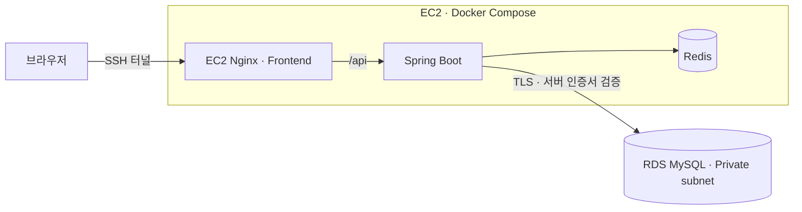
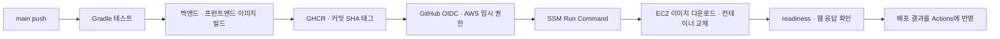
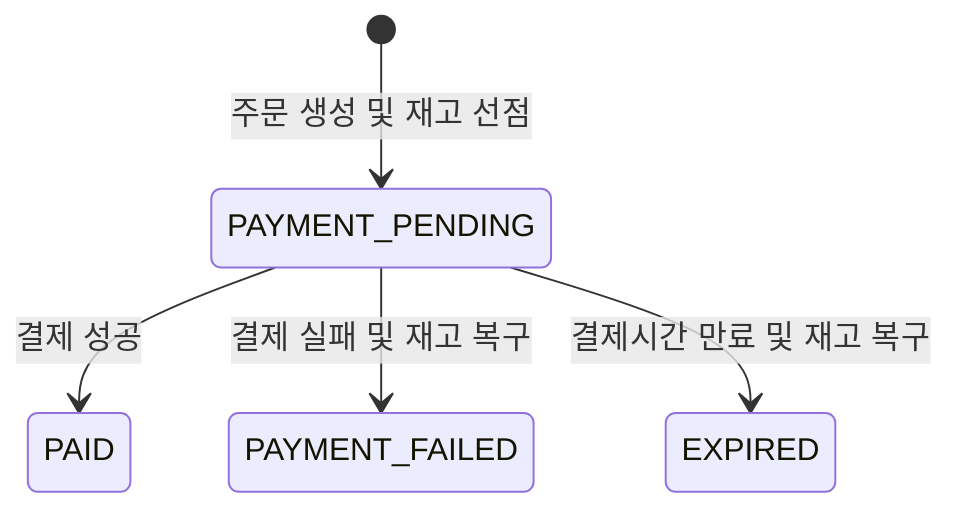

# Shop — 주문 정합성 검증부터 AWS 자동 배포까지

회원·상품·장바구니·주문·결제 흐름을 구현한 **Spring Boot 기반 1인 이커머스 프로젝트**입니다. 조건부 UPDATE로 동시 주문의 재고 정합성을 검증하고, 실행계획 기반 인덱스 튜닝으로 상품 검색 지연을 개선했습니다. AWS EC2·RDS에 배포하고 GitHub Actions로 테스트·이미지 빌드·배포를 연결했습니다.

## 핵심 결과

| 주제 | 구현과 검증 결과 | 근거 |
| --- | --- | --- |
| 검색 성능 | 20만 건 상품 검색의 API p95 중앙값 **1,333.63 → 39.86ms, 약 97% 감소** | [실행계획·k6 실험](./performance/index-tuning/README.md) |
| 동시 주문 | 재고 10개 상품에 동시 요청 20개를 실행해 **성공 주문 10건·최종 재고 0개** 확인 | 아래 테스트 시나리오 |
| 배포 자동화 | **main push → 테스트 → 이미지 빌드·GHCR → OIDC·SSM → EC2** 배포 | [워크플로](./.github/workflows/deploy.yml) · [Actions 실행 기록](https://github.com/chtj1024/E-commerce_Project/actions) |

검색 성능 수치는 기존 인덱스 실험 결과입니다. k6는 전후 각각 10 RPS·2분·3회 실행의 p95 중앙값을 비교했으며, AWS 배포 환경에서 새로 측정한 수치가 아닙니다.

[포트폴리오](https://app.notion.com/p/3c47b079826d81afa1f3f11ad400a673) · [AWS 구성과 CI/CD](#aws-배포와-cicd) · [핵심 설계](#핵심-설계) · [테스트](#테스트) · [로컬 실행](#로컬-실행)

## 프로젝트 정보

| 항목 | 내용 |
| --- | --- |
| 개발 기간 | 2026.07 ~ 2026.09 |
| 개발 인원 | 1명 |
| 담당 범위 | 백엔드 설계·구현, 프런트엔드, 테스트·성능 실험, AWS 배포·CI/CD |
| 주요 관심사 | 주문·결제 정합성, 조회 성능, 캐시 안정성, 배포 자동화 |

## 기술 스택

| 영역 | 기술과 사용 목적 |
| --- | --- |
| Backend | Java 21, Spring Boot 3.5, Spring Data JPA, QueryDSL |
| Security / API | Spring Security, JWT, Swagger / OpenAPI |
| Database / Cache | MySQL 8.4, Redis 7, Spring Cache, Flyway |
| Test / Performance | JUnit 5, Testcontainers, k6, EXPLAIN ANALYZE |
| AWS / Delivery | EC2, RDS MySQL, VPC, IAM, Systems Manager, GitHub Actions, GHCR |
| Runtime | Docker, Docker Compose, Nginx, Spring Boot Actuator |
| Frontend | React 19, TypeScript, Vite, Axios |

## 주요 기능

- 회원가입 및 로그인
- JWT Access Token·Refresh Token 발급과 재발급
- Refresh Token Rotation 및 로그아웃 처리
- 사용자·관리자 역할 기반 접근 제어
- 상품 등록·수정·상태 및 재고 관리
- 키워드·카테고리·가격 범위 기반 상품 복합 검색
- 가격 범위·가격순 검색에 `(price ASC, id DESC)` 복합 인덱스를 적용하고 `EXPLAIN ANALYZE`와 k6로 전후 성능 검증
- 검증된 인덱스 DDL을 Flyway 버전 마이그레이션으로 관리
- Redis 기반 상품 단건 조회 캐시, 동일 키 동시 미스 병합 및 키 단위 무효화
- Redis 조회·저장·무효화 실패 시 MySQL 원본 데이터와 DB 작업을 우선하는 Look-aside Fallback
- 장바구니 상품 추가·수정·삭제
- 복수 상품 주문 및 주문 당시 상품 정보 보존
- 결제 성공·실패 처리
- 결제 대기시간이 지난 주문의 자동 만료 및 재고 복구

## AWS 배포와 CI/CD

### 실행 환경

EC2 한 대에서 Nginx·프런트엔드, Spring Boot, Redis를 컨테이너로 실행하고, MySQL은 RDS로 분리했습니다. RDS는 프라이빗 서브넷에 두고 EC2 보안 그룹에서 오는 DB 연결만 허용했습니다. 브라우저 기능은 **SSH 터널로 검증**했으며, 공개 도메인·HTTPS 서비스는 구성하지 않았습니다.



- [배포 Compose](./deploy/aws/compose.yaml): 컨테이너 메모리·로그 크기를 제한하고 Redis 데이터는 named volume에 보관합니다.
- RDS 연결에는 `sslMode=VERIFY_IDENTITY`와 Java truststore를 사용합니다. DB 비밀번호·JWT 키는 EC2의 별도 환경변수 파일로 관리합니다.
- 스키마 변경은 Flyway로 적용하고 Hibernate는 `ddl-auto=validate`로 엔티티와 DB의 일치 여부를 확인합니다.
- 최초 구성 이후 애플리케이션 배포는 GitHub Actions가 수행합니다. 서버의 Compose·배포 스크립트·인증서 설정은 별도의 초기 설정 대상입니다.

### main push 자동 배포



| 단계 | 동작 | 선택 이유 |
| --- | --- | --- |
| 테스트 | GitHub 실행 서버의 MySQL·Redis 환경에서 `./gradlew test --no-daemon` 실행 | 배포 전 테스트를 실행하고 테스트 실패 시 후속 빌드·배포를 진행하지 않음 |
| 빌드·보관 | 백엔드·프런트엔드 이미지를 GHCR에 업로드 | 작은 EC2에서 빌드하지 않고 실행만 담당 |
| 버전 식별 | 전체 Git 커밋 SHA를 이미지 태그로 사용 | 배포 코드와 실행 이미지의 대응 관계 확인 |
| AWS 인증 | OIDC로 배포 역할의 임시 자격 증명 발급 | GitHub에 장기 AWS 액세스 키를 저장하지 않음 |
| 원격 실행 | SSM으로 EC2의 배포 스크립트 실행 | GitHub 실행 서버의 IP를 SSH 허용 목록에 추가할 필요가 없음 |
| 성공 판정 | Compose healthcheck와 `/healthz`·웹 응답 확인 후 SSM 최종 상태 조회 | 명령 전달만으로 배포 성공 처리하지 않음 |

[워크플로 코드](./.github/workflows/deploy.yml) · [배포 스크립트](./deploy/aws/deploy.sh) · [Actions 실행 기록](https://github.com/chtj1024/E-commerce_Project/actions)

워크플로는 `main` push와 수동 실행을 지원합니다. `DEPLOY_ENABLED=true`일 때 배포하며, `AWS_ROLE_ARN`과 `EC2_INSTANCE_ID`로 배포 역할과 대상을 지정합니다. GitHub의 concurrency 설정과 서버의 `flock`으로 배포 작업이 겹치지 않도록 구성했습니다.

### 상태 확인과 검증 범위

- Actuator readiness에 앱 상태·MySQL·Redis를 포함하고, 프런트엔드 프록시를 통한 `/healthz` 응답도 확인합니다.
- 정상 배포 후 커밋 SHA를 기록해 실행 중인 버전을 식별합니다.
- AWS에서의 배포·재배포 및 SSH 터널을 통한 기능 확인을 수행했습니다. readiness 확인과 사용자 기능 테스트는 별도의 검증입니다.
- 단일 EC2·Single-AZ RDS를 사용한 소규모 검증 환경이며, 컨테이너 교체 시 중단이 발생할 수 있습니다.

### 배포 후 확인 명령

아래 명령은 초기 설정과 배포가 끝난 **EC2**에서 실행합니다.

```bash
cd /opt/shop
sudo docker compose --env-file .env --env-file current.env ps
sudo docker compose --env-file .env --env-file current.env logs --tail=100 backend
curl --fail http://127.0.0.1:8088/healthz
sudo cat /opt/shop/current.env
```

외부 브라우저 접근은 SSH 터널을 사용합니다. `EC2_PUBLIC_IP`와 키 경로는 본인 값으로 바꿉니다.

```powershell
ssh -i "C:\path\to\shop-demo-key.pem" -N -L 18080:127.0.0.1:8088 ubuntu@EC2_PUBLIC_IP
```

터널 연결 중 `http://localhost:18080`으로 접속합니다. 데이터와 애플리케이션은 AWS에서 실행되며 공개 URL은 제공하지 않습니다.

## 핵심 설계

### 주문·결제 상태 흐름



주문 상태가 `PAYMENT_PENDING`일 때만 다음 상태로 변경할 수 있도록 조건부 UPDATE를 사용했습니다. 결제 성공, 결제 실패, 만료 처리가 동시에 또는 중복 실행돼도 최초로 상태 변경에 성공한 처리만 후속 작업을 수행합니다.

### 재고 차감

재고를 조회한 뒤 애플리케이션에서 차감하면 여러 요청이 동일한 재고 값을 읽어 초과 판매가 발생할 수 있습니다. 이를 방지하기 위해 다음 조건을 포함한 원자적 UPDATE로 재고를 차감합니다.

- 상품 상태가 `ACTIVE`일 것
- 현재 재고가 주문 수량 이상일 것
- 차감 결과가 0이면 상품 상태를 `SOLD_OUT`으로 변경할 것

UPDATE 결과가 0건이면 재고 부족 또는 판매 불가능 상품으로 처리합니다. 여러 상품을 주문할 때는 상품 ID 순서로 차감해 서로 다른 순서의 자원 점유로 인한 데드락 가능성도 줄였습니다.

### 주문 상품 스냅샷

상품의 이름이나 가격이 변경되거나 상품이 삭제된 이후에도 주문 당시 정보를 유지할 수 있도록 주문 상품에 다음 값을 별도로 저장합니다.

- 상품 ID
- 주문 당시 상품명
- 주문 당시 단가
- 주문 수량

### 만료 주문 처리

결제 대기 주문은 생성 시점으로부터 15분의 유효시간을 갖습니다. 스케줄러는 30초마다 만료된 주문을 최대 100건씩 조회하며, 각 주문을 별도 트랜잭션으로 처리합니다.

- `status + expiresAt` 복합 인덱스로 만료 대상 조회
- `PAYMENT_PENDING` 상태이며 실제 만료된 주문만 선점
- 선점에 성공한 처리만 재고 복구
- 개별 주문 처리 실패가 다음 주문 처리에 영향을 주지 않도록 예외 격리

### 인증·인가

- 비밀번호를 BCrypt로 해싱
- Access Token과 Refresh Token의 용도 분리
- Refresh Token을 HttpOnly 쿠키로 전달
- 토큰 재발급 시 기존 Refresh Token을 새 토큰으로 교체
- 로그아웃 시 저장된 Refresh Token 무효화
- `USER`, `ADMIN` 역할에 따른 API 접근 제어

운영 환경에서는 HTTPS를 적용하고 Refresh Token 쿠키의 `Secure` 옵션을 활성화해야 합니다.

### Redis 상품 조회 캐시와 장애 Fallback

읽기 빈도가 높은 상품 단건 조회(`GET /api/products/{productId}`)에 Spring Cache와 Redis를 적용했습니다.

- 상품 ID를 캐시 키로 사용하고 TTL을 10분으로 설정
- null 응답은 캐시하지 않아 일시적인 조회 실패가 남지 않도록 구성
- `sync = true`로 동일 키의 동시 캐시 미스를 병합해 Cache Stampede 완화
- 상품 정보·재고·판매 상태 수정 및 삭제 시 해당 상품 키를 즉시 무효화
- `ProductResponse` 전용 JSON 직렬화로 캐시 데이터 형식을 명확히 제한

조회 성능뿐 아니라 데이터 최신성을 함께 고려해, 쓰기 작업마다 전체 캐시를 비우는 대신 변경된 상품의 키만 제거합니다.

Redis는 조회 성능을 높이기 위한 보조 저장소로 두고, MySQL을 원본 데이터로 유지하는 Look-aside 패턴을 적용했습니다. `CacheErrorHandler`에서 Redis 예외를 다음과 같이 격리합니다.

| 실패 지점 | Fallback 동작 |
| --- | --- |
| 캐시 조회(GET) | 경고 로그를 남기고 `@Cacheable` 대상 메서드를 실행해 MySQL에서 조회 |
| 캐시 저장(PUT) | 캐시 저장 실패를 전파하지 않고 이미 조회한 MySQL 결과를 반환 |
| 키 무효화(EVICT) | 경고 로그를 남기고 상품 변경·재고 처리 등 DB 작업은 계속 수행 |
| 전체 무효화(CLEAR) | 캐시 예외를 서비스 계층으로 전파하지 않고 경고 로그 기록 |

이 Fallback은 Redis 장애 시 서비스 기능을 계속 제공하기 위한 가용성 대책입니다. 다만 캐시 무효화 실패 시 TTL이 끝날 때까지 오래된 데이터가 노출될 수 있고, Redis 장애가 지속되면 조회 요청이 MySQL로 집중될 수 있습니다. 현재 구현은 예외 격리와 로그 기록까지 담당하며, 무효화 재시도와 DB 과부하 보호는 별도 운영 대책이 필요합니다.

### 실행계획 기반 상품 검색 인덱스 튜닝

20만 건의 상품 데이터에서 가격 범위 검색과 `price ASC, id DESC` 정렬을 수행하는 API를 대상으로 실행계획과 부하 테스트를 연결해 검증했습니다.

```http
GET /api/products?minPrice=50000&maxPrice=60000&page=0&size=12&sort=priceAsc
```

인덱스 적용 전에는 20만 건 전체를 탐색하고 조건에 맞는 9,551건을 정렬한 뒤 12건을 반환했습니다. 가격 범위와 정렬 순서를 함께 처리하도록 다음 복합 인덱스를 설계했습니다.

```sql
CREATE INDEX idx_product_price_id
    ON product (price ASC, id DESC);
```

- `price`: 가격 범위 조건과 첫 번째 정렬 기준
- `id`: 동일 가격 상품의 정렬 순서를 결정하는 두 번째 기준
- `status` 제외: 선택도가 낮고 `<> 'HIDDEN'` 조건이므로 선두 컬럼으로 두지 않음

인덱스 적용 후 목록 SQL은 Table scan과 별도 Sort에서 Index range scan으로 변경됐으며, `LIMIT 12`에 필요한 행을 찾은 즉시 탐색을 종료했습니다. 검증된 DDL은 Flyway `V3` 마이그레이션으로 버전 관리했습니다.

| 측정 항목 | 적용 전 중앙값 | 적용 후 중앙값 | 변화 |
| --- | ---: | ---: | ---: |
| 목록 SQL `EXPLAIN ANALYZE` | 185 ms | 0.178 ms | 약 99.9% 감소 |
| COUNT SQL `EXPLAIN ANALYZE` | 84.5 ms | 29.4 ms | 약 65.2% 감소 |
| k6 평균 응답시간 | 704.27 ms | 28.35 ms | 약 96.0% 감소 |
| k6 p95 | 1,333.63 ms | 39.86 ms | 약 97.0% 감소 |
| k6 p99 | 1,497.33 ms | 74.48 ms | 약 95.0% 감소 |

실행계획은 적용 전후 각각 5회, k6는 10 RPS·2분 조건에서 각각 3회 측정하고 중앙값을 대표값으로 사용했습니다. 적용 전 1회차에는 처리 지연 누적으로 dropped iteration 81건이 발생했지만 적용 후 3회 모두 dropped iteration과 HTTP 실패가 0건이었습니다. 세부 실험 조건과 원문 결과는 [`performance/index-tuning`](./performance/index-tuning/README.md)에 기록했습니다.

## 테스트

Docker와 Testcontainers를 이용해 MySQL 8.4 환경에서 테스트했으며 전체 테스트가 통과했습니다.

| 구분 | 검증 내용 |
| --- | --- |
| 주문 생성 | 주문 생성 시 재고 차감 및 `PAYMENT_PENDING` 상태 확인 |
| 트랜잭션 | 복수 상품 중 하나의 재고가 부족할 때 전체 롤백 |
| 동시 주문 | 재고보다 많은 요청에도 초과 판매가 발생하지 않는지 확인 |
| 결제 실패 | 실패 상태 전이 및 차감된 재고 복구 |
| 중복 결제 실패 | 중복 호출에도 재고가 한 번만 복구되는지 확인 |
| 주문 만료 | 만료된 주문의 상태 변경 및 재고 복구 |
| 중복 만료 | 반복 실행에도 재고가 한 번만 복구되는지 확인 |
| 만료 조건 | 만료시간이 지나지 않은 주문을 처리하지 않는지 확인 |
| 상태 경합 | 결제 성공과 만료가 동시에 실행돼도 상태와 재고가 일치하는지 확인 |

```bash
./gradlew test
```

Windows에서는 다음 명령으로 실행할 수 있습니다.

```powershell
.\gradlew.bat test
```

### k6 상품 조회 부하 테스트

`constant-arrival-rate` 실행기로 상품 단건 조회의 요청률을 고정하고, 캐시 적용 전과 Redis warm cache 구간을 각각 반복 측정했습니다. 모든 측정에서 HTTP 실패율은 0%였습니다.

| 구분 | 실행 조건 | 유효 요청 | p95 응답시간 | 비고 |
| --- | --- | ---: | ---: | --- |
| 적용 전 1차 | 약 100 RPS, 3분 | 18,001 | 4.59 ms | dropped 0 |
| 적용 전 2차 | 약 100 RPS, 3분 | 18,001 | 4.59 ms | dropped 0 |
| 적용 전 3차 | 약 100 RPS, 3분 | 17,998 | 6.06 ms | dropped 3 |
| Redis warm 1차 | 10 RPS, 2분 | 1,201 | 7.73 ms | HTTP 실패 0% |
| Redis warm 2차 | 10 RPS, 2분 | 1,201 | 5.28 ms | HTTP 실패 0% |
| Redis warm 3차 | 10 RPS 설정 | 702 | 5.54 ms | dropped 1,002로 부하 발생기 이상치 분리 |

기존 결과와 warm cache 결과는 요청률과 실행 시간이 달라 이 수치로 개선율을 계산하지 않았습니다. 현재 결과는 캐시 hit 경로의 안정성과 실패율을 확인하는 근거로 사용하며, 정량적인 전후 비교는 동일한 RPS·duration·실행 환경으로 다시 측정해야 합니다.

```bash
k6 run -e RATE=100 -e DURATION=3m performance/redis-cache/k6/scripts/product-read-baseline.js
k6 run -e RATE=100 -e DURATION=3m performance/redis-cache/k6/scripts/product-read-warm.js
```

측정 시 애플리케이션·MySQL·Redis 상태를 동일하게 맞추고, warm 테스트는 `setup()`에서 대상 상품을 한 번 조회해 캐시를 예열합니다.

### k6 상품 검색 인덱스 Before/After 테스트

가격 범위 검색 API에 `constant-arrival-rate`로 10 RPS를 2분간 유지하고, 인덱스 적용 전후를 각각 3회 측정했습니다. 모든 실행에서 HTTP 실패율은 0%였으며, 대표값은 세 번의 중앙값입니다.

| 구분 | 평균 | p95 | p99 | dropped iterations |
| --- | ---: | ---: | ---: | ---: |
| 인덱스 적용 전 중앙값 | 704.27 ms | 1,333.63 ms | 1,497.33 ms | 0건¹ |
| 인덱스 적용 후 중앙값 | 28.35 ms | 39.86 ms | 74.48 ms | 0건 |

¹ 적용 전 1회차에는 DB 처리 지연이 누적되며 81건이 dropped됐습니다. 해당 이상치를 삭제하지 않고 원문 결과를 보존했으며, 단일 실행이 결론을 왜곡하지 않도록 3회 중앙값으로 비교했습니다.

```bash
k6 run -e TEST_TYPE=load -e RATE=10 -e DURATION=2m performance/index-tuning/k6/scripts/product-search.js
```

## 로컬 실행

### Docker 구성

| 구성 요소 | 역할 | 호스트 포트 | 데이터 유지 |
| --- | --- | ---: | --- |
| MySQL 8.4 | 원본 데이터베이스 | `3307` | `mysql_data` 볼륨 |
| Redis 7 | 상품 조회 캐시 | `7379` | `redis_data` 볼륨 |
| Frontend | 프론트엔드 서비스 | `3000` | 해당 없음 |
| Backend image | Spring Boot 애플리케이션 이미지 | `8080` | 해당 없음 |

루트의 로컬 개발용 `compose.yaml`은 MySQL, Redis, Frontend를 실행합니다. AWS 실행 구성은 `deploy/aws/compose.yaml`로 분리했습니다. Backend는 Compose 서비스에 포함하지 않았으며, 루트 `Dockerfile`로 이미지를 별도 빌드할 수 있습니다.

- MySQL과 Redis에 `healthcheck`를 적용해 컨테이너 상태를 확인합니다.
- MySQL과 Redis 데이터는 named volume에 저장해 컨테이너를 재생성해도 유지합니다.
- 호스트 포트는 `127.0.0.1`에 바인딩해 로컬 환경에서만 접근하도록 구성했습니다.
- Backend 이미지는 JDK 빌드 단계와 JRE 실행 단계를 분리한 멀티스테이지 빌드를 사용하며, 런타임에서는 비루트 `spring` 사용자로 실행합니다.
- 실제 환경변수·인증서·개인 키는 저장소와 이미지에 포함하지 않도록 관리합니다.

### Docker Compose로 인프라와 Frontend 실행

프로젝트 루트에 `.env` 파일을 만들고 Compose에서 사용하는 값을 설정합니다.

```properties
DB_USERNAME=your_mysql_username
DB_PASSWORD=your_mysql_password
MYSQL_ROOT_PASSWORD=your_mysql_root_password
```

MySQL, Redis, Frontend를 실행하고 상태를 확인합니다.

```bash
docker compose up -d mysql redis frontend
docker compose ps
```

Compose 환경에서 MySQL은 호스트의 `3307` 포트, Redis는 `7379` 포트, Frontend는 `3000` 포트로 접근할 수 있습니다.

```text
MySQL: 127.0.0.1:3307
Redis: 127.0.0.1:7379
Frontend: http://localhost:3000
```

컨테이너를 종료하되 데이터 볼륨은 유지하려면 다음 명령을 사용합니다.

```bash
docker compose down
```

다음 명령은 MySQL과 Redis의 저장 데이터까지 삭제하므로 초기화가 필요한 경우에만 사용합니다.

```bash
docker compose down -v
```

### Backend Docker 이미지 빌드

루트 `Dockerfile`은 Gradle Wrapper로 Spring Boot 실행 JAR을 빌드한 뒤 JRE 기반 런타임 이미지에 복사합니다. 테스트는 이미지 빌드 단계에서 제외되므로 이미지 빌드 전에 별도로 실행해야 합니다.

```bash
./gradlew test
docker build -t shop-backend .
```

Backend 컨테이너를 실행할 때는 MySQL, Redis, JWT 설정 등 애플리케이션에 필요한 환경변수를 실행 환경에 맞게 전달해야 합니다. 로컬 개발용 Compose에는 Backend가 포함되지 않으므로 아래 `bootRun`으로 실행합니다. AWS용 Compose에서는 Backend도 컨테이너로 실행합니다.

### 사전 준비

- Java 21
- MySQL 8
- Redis
- Node.js
- k6

### 환경 변수

프로젝트 루트에 `.env` 파일을 만들고 다음 값을 설정합니다.

```properties
DB_USERNAME=your_mysql_username
DB_PASSWORD=your_mysql_password
MYSQL_ROOT_PASSWORD=your_mysql_root_password
JWT_SECRET=your_base64_encoded_secret_key
REDIS_HOST=localhost
REDIS_PORT=7379
```

`.env`에는 비밀번호와 JWT Secret이 포함되므로 Git에 커밋하지 않습니다. `MYSQL_ROOT_PASSWORD`는 Docker Compose의 MySQL 초기화에 사용합니다. 현재 `application.yaml`은 `optional:file:.env[.properties]`를 가져옵니다. 프로젝트 루트를 작업 디렉터리로 실행하면 해당 파일을 설정값으로 읽으며, OS 환경변수와는 별개입니다. 다른 작업 디렉터리에서 실행하면 IDE·셸에 값을 전달하거나 설정 파일 경로를 맞춰야 합니다.

### Backend

MySQL에 `shop` 데이터베이스를 생성하고 Redis를 실행한 후 애플리케이션을 시작합니다.

```sql
CREATE DATABASE shop;
```

```bash
./gradlew bootRun
```

애플리케이션 실행 후 Swagger UI에서 API 명세를 확인할 수 있습니다.

```text
http://localhost:8080/swagger-ui.html
```

### Frontend

```bash
cd frontend
npm install
npm run dev
```

```text
http://localhost:5173
```

## 프로젝트 구조

```text
shop
├─ src/main/java/com/taejun/shop
│  ├─ domain
│  │  ├─ member
│  │  ├─ product
│  │  ├─ cart
│  │  ├─ order
│  │  └─ payment
│  └─ global
│     ├─ config
│     ├─ exception
│     └─ security
├─ .github/workflows/deploy.yml
├─ deploy/aws
│  ├─ compose.yaml
│  └─ deploy.sh
├─ performance
│  ├─ redis-cache
│  └─ index-tuning
│     ├─ explain-analyze
│     └─ k6
├─ src/main/resources/db/migration
│  ├─ V1__create_initial_schema.sql
│  └─ V3__add_product_composite-index.sql
├─ src/test/java/com/taejun/shop
│  ├─ domain
│  └─ support
└─ frontend
   └─ src
      ├─ api
      ├─ auth
      ├─ components
      ├─ pages
      └─ types
```

도메인별로 컨트롤러, 서비스, 리포지토리, 엔티티 및 DTO를 구성하고 공통 설정과 보안·예외 처리는 `global` 패키지로 분리했습니다.

## 향후 개선 계획

- 공개 운영 시 도메인·HTTPS 및 환경별 쿠키 설정 적용
- 실행 환경의 메모리·디스크 사용량을 지속 측정하고 배포 구성 변경도 코드와 일치하도록 관리

- Refresh Token 해싱 저장
- 운영 환경별 CORS 및 쿠키 보안 설정 분리
- 허용된 필드만 사용할 수 있도록 상품 정렬 조건 제한
- 동일 조건의 Redis 적용 전·후 k6 재측정과 병목 구간 프로파일링
- Redis 무효화 실패 작업의 Outbox 저장 및 재시도 처리
- Redis 장애 통합 테스트와 장애 중 MySQL 과부하를 막기 위한 타임아웃·트래픽 보호 전략 보완
- 운영 환경을 고려한 만료 주문 다중 인스턴스 처리 전략 보완
